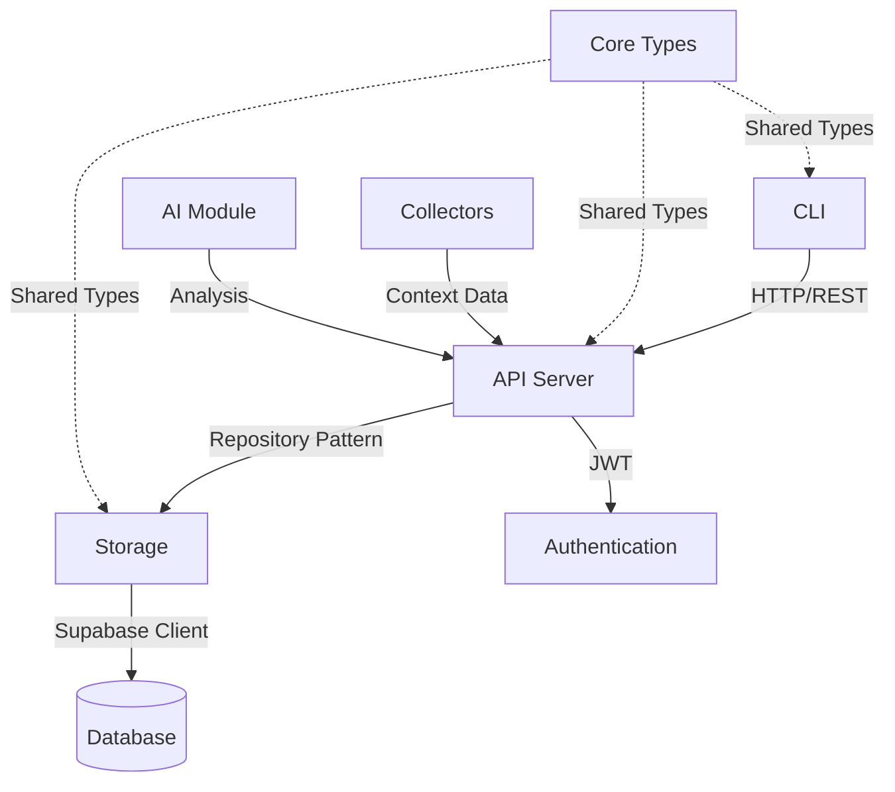

# Integration Analyzer

## Purpose
Maps connections between modules and identifies gaps, ensuring all pieces actually work together and finding missing links.

## When to Run
- When adding new modules
- Before releases
- After major refactoring
- When integration bugs surface
- During architecture reviews

## Analysis Process

### 1. Module Dependency Mapping

```bash
# Analyze package dependencies
echo "## Module Dependency Graph"
for pkg in packages/@crumb/*/package.json; do
  dir=$(dirname $pkg)
  name=$(basename $dir)
  echo "### $name"
  echo "Dependencies:"
  grep -E '"@crumb/.*":|"dependencies":|"devDependencies":' $pkg -A 20 | grep "@crumb" | grep -v Dependencies
done
```

### 2. Import Analysis

```bash
# Find all cross-module imports
echo "## Cross-Module Imports"
for module in packages/@crumb/*/src; do
  echo "### $(basename $(dirname $module))"
  grep -r "from '@crumb" $module 2>/dev/null | cut -d: -f2- | sort | uniq
done
```

### 3. API Contract Verification

```typescript
// Verify interfaces match between modules
interface IntegrationCheck {
  module: string;
  exports: string[];
  imports: { from: string; items: string[] }[];
  mismatches: string[];
}
```

### 4. Runtime Integration Testing

```bash
# Test actual module integration
npm run test:integration

# Check for runtime import errors
npm run build && npm run start:dev 2>&1 | grep -E "Cannot find module|Module not found"
```

## Integration Maps

### Core Integration Points



### Data Flow Paths

#### 1. Crumb Creation Flow
```
CLI.createCrumb() 
  → API.POST /api/crumbs
    → Storage.CrumbRepository.create()
      → Database.crumbs.insert()
        → Response → API → CLI
```

#### 2. Context Collection Flow
```
Collector.collect()
  → Context Data
    → API.POST /api/contexts
      → Storage.ContextRepository.create()
        → Database.contexts.insert()
```

#### 3. Authentication Flow
```
CLI.init()
  → Get API Key
    → API.authenticate()
      → Supabase.auth.verify()
        → JWT Token → CLI.config.save()
```

## Integration Health Checks

### Module Readiness Checklist

#### ✅ Ready for Integration
- [ ] Package exports properly defined
- [ ] TypeScript types from @crumb/core
- [ ] Error handling follows patterns
- [ ] Logging implemented
- [ ] Tests cover integration points

#### 🚧 Integration Issues
- [ ] Missing type exports
- [ ] Incompatible interfaces
- [ ] Circular dependencies
- [ ] Version mismatches
- [ ] Missing error handling

### Integration Test Matrix

| From | To | Test | Status | Notes |
|------|-----|------|--------|-------|
| CLI | API | HTTP requests | ✅ | Axios client working |
| API | Storage | Repository calls | ✅ | All CRUD operations |
| Storage | Database | Supabase queries | ✅ | Connection established |
| CLI | Config | File persistence | ✅ | Config saves/loads |
| API | Auth | JWT validation | ✅ | Supabase integration |
| Collectors | API | Context submission | ❌ | Not implemented |
| AI | API | Analysis requests | ❌ | Not implemented |

## Gap Analysis

### Missing Integrations

#### 1. Collector Integration
**Gap**: No collectors implemented
**Impact**: No automatic context capture
**Required**:
- Base collector interface
- HTTP client for context submission
- Batch upload capability
- Error recovery

#### 2. AI Integration
**Gap**: AI module not started
**Impact**: No intelligent features
**Required**:
- LLM provider setup
- API endpoints for AI features
- Context aggregation
- Response caching

#### 3. Real-time Updates
**Gap**: No WebSocket/SSE implementation
**Impact**: No live updates
**Required**:
- WebSocket server
- Event broadcasting
- Client subscriptions

### Broken Integrations

#### 1. CLI Help Command
**Issue**: Stack overflow on --help
**Affects**: User experience
**Root Cause**: Commander.js circular dependency
**Fix**: Restructure command imports

#### 2. HTTPS Configuration
**Issue**: CLI defaults to HTTP
**Affects**: Production usage
**Root Cause**: Hardcoded HTTP URL
**Fix**: Update default config

## Integration Priorities

### 🚨 Critical (Blocking)
1. Fix CLI help command
2. Update HTTPS defaults
3. Verify auth flow end-to-end

### ⚠️ Important (Next Sprint)
1. Implement base collector
2. Add system context collector
3. Create integration test suite

### 📋 Nice to Have
1. WebSocket support
2. Batch operations
3. Offline queue

## AI Memory Notes

**Integration State**:
```yaml
last_analyzed: [timestamp]
working_integrations:
  - cli_to_api: true
  - api_to_storage: true
  - storage_to_database: true
broken_integrations:
  - cli_help_command: "stack overflow"
  - https_config: "defaults to http"
missing_integrations:
  - collectors: "not implemented"
  - ai_module: "not started"
  - realtime: "no websocket"
```

**Dependency Graph**:
```yaml
@crumb/cli:
  depends_on: ["@crumb/core"]
  integrates_with: ["@crumb/api"]
  
@crumb/api:
  depends_on: ["@crumb/core", "@crumb/storage"]
  integrates_with: ["@crumb/cli", "future: @crumb/collectors", "future: @crumb/ai"]
  
@crumb/storage:
  depends_on: ["@crumb/core", "@supabase/supabase-js"]
  integrates_with: ["@crumb/api"]
  
@crumb/core:
  depends_on: []
  integrates_with: ["all modules"]
```

## Integration Verification Script

```bash
#!/bin/bash
# integration_check.sh

echo "=== Integration Analysis ==="
echo

# Check module builds
echo "1. Checking module builds..."
npm run build

# Check import resolution
echo "2. Checking import resolution..."
for pkg in packages/@crumb/*/; do
  echo "   - $(basename $pkg)"
  cd $pkg && npm run typecheck 2>&1 | grep -E "error|Error" || echo "     ✓ OK"
  cd - > /dev/null
done

# Check integration tests
echo "3. Running integration tests..."
npm run test:integration

# Check API endpoints
echo "4. Checking API endpoints..."
if curl -s http://localhost:3000/api/health > /dev/null; then
  echo "   ✓ API responding"
else
  echo "   ✗ API not responding"
fi

# Generate report
echo
echo "=== Integration Report ==="
date
```

## Next Steps

1. **Fix Critical Issues**: Address CLI and HTTPS problems
2. **Run Full Analysis**: Execute integration verification
3. **Update Spec**: Document actual integration state
4. **Plan Collectors**: Design collector integration
5. **Test E2E**: Verify complete user workflows