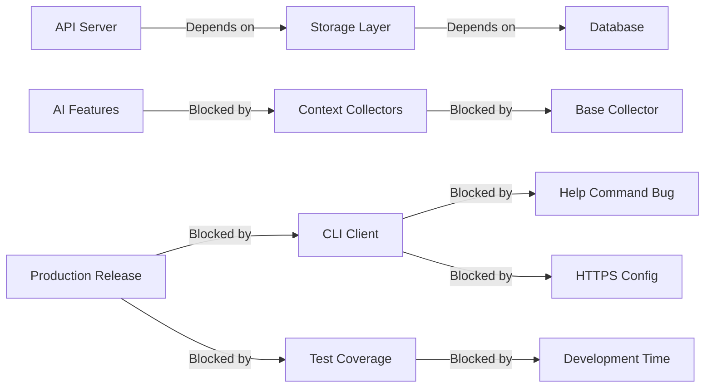

# Critical Path Tracker

## Purpose
Identifies what's blocking progress and prioritizes next steps, keeping development focused on what matters most.

## When to Run
- Start of development sessions
- When priorities shift
- After discovering blockers
- During sprint planning
- When progress stalls

## Critical Path Analysis

### 1. Blocker Identification

```bash
# Find TODO/FIXME/HACK markers
echo "## Code-Level Blockers"
grep -r "TODO\|FIXME\|HACK\|BUG\|XXX" packages/*/src/ --include="*.ts" --include="*.js" | 
  grep -v node_modules | 
  awk -F: '{print $1 ": " $3}'

# Check failing tests
echo "## Test Failures"
npm test 2>&1 | grep -E "FAIL|✗|Error:|failed"

# Find type errors
echo "## TypeScript Errors"
npm run typecheck 2>&1 | grep -E "error TS|Error:"
```

### 2. Dependency Chain Analysis



### 3. Impact Assessment

#### Blocker Severity Levels

**🚨 CRITICAL** (Prevents usage)
- Breaks core functionality
- Security vulnerabilities
- Data loss potential
- Blocks other developers

**⚠️ HIGH** (Degrades experience)
- Major features unavailable
- Performance issues
- Partial functionality loss
- Blocks important features

**📋 MEDIUM** (Inconvenient)
- Minor features affected
- Workarounds available
- Quality of life issues
- Blocks nice-to-have features

**💡 LOW** (Polish needed)
- Cosmetic issues
- Documentation gaps
- Code cleanup
- Technical debt

## Current Critical Path

### 🚨 Immediate Blockers (This Session)

#### 1. CLI Help Command Stack Overflow
- **Impact**: Users cannot access help documentation
- **Blocking**: User onboarding, documentation
- **Root Cause**: Commander.js circular dependency
- **Fix Path**:
  ```typescript
  // Restructure command imports to avoid circular deps
  // Move command definitions to separate files
  // Lazy load command modules
  ```
- **Time Estimate**: 1-2 hours
- **Dependencies**: None

#### 2. HTTPS Configuration Default
- **Impact**: Production users must manually configure
- **Blocking**: Seamless production usage
- **Root Cause**: Hardcoded HTTP URL
- **Fix Path**:
  ```typescript
  // Update default config
  const DEFAULT_API_URL = 'https://crumb.jfive.dev/api';
  ```
- **Time Estimate**: 30 minutes
- **Dependencies**: None

### ⚠️ High Priority (Next Sprint)

#### 3. Test Coverage Gaps
- **Impact**: Uncertain code quality
- **Blocking**: Confident releases
- **Missing Tests**:
  - @crumb/core utilities
  - @crumb/cli commands
  - @crumb/api routes
- **Fix Path**: Write comprehensive unit tests
- **Time Estimate**: 1-2 days
- **Dependencies**: None

#### 4. Base Collector Implementation
- **Impact**: No context collection
- **Blocking**: All collectors, AI features
- **Fix Path**:
  ```typescript
  // Create base collector class
  // Define standard interfaces
  // Implement plugin system
  ```
- **Time Estimate**: 1 day
- **Dependencies**: Integration design

### 📋 Medium Priority (Next Month)

#### 5. System Context Collector
- **Impact**: Limited context awareness
- **Blocking**: Full context features
- **Dependencies**: Base collector

#### 6. AI Module Foundation
- **Impact**: No intelligent features
- **Blocking**: Advanced capabilities
- **Dependencies**: Collectors, API endpoints

## Fastest Path to Milestones

### 🎯 Milestone: Production Ready CLI (1 day)
1. Fix CLI help command (2 hrs)
2. Update HTTPS default (30 min)
3. Test full user workflow (1 hr)
4. Update documentation (30 min)

### 🎯 Milestone: Full Test Coverage (2-3 days)
1. Core utilities tests (4 hrs)
2. CLI command tests (8 hrs)
3. API route tests (8 hrs)
4. Integration test fixes (2 hrs)

### 🎯 Milestone: Context Collection (1 week)
1. Design collector interfaces (2 hrs)
2. Implement base collector (8 hrs)
3. Create system collector (16 hrs)
4. API integration (8 hrs)
5. Testing & debugging (8 hrs)

### 🎯 Milestone: AI Features (2 weeks)
1. Complete collectors (1 week)
2. LLM provider setup (1 day)
3. Summarization logic (2 days)
4. Query interface (2 days)
5. Testing & tuning (2 days)

## Technical Debt Assessment

### 🔴 Critical Debt
- No error recovery in CLI
- Missing retry logic in API client
- No offline queue implementation

### 🟡 Accumulating Debt
- Inconsistent error handling
- Missing performance monitoring
- Limited logging coverage
- No request tracing

### 🟢 Manageable Debt
- Code duplication in tests
- Missing JSDoc in some files
- Inconsistent naming conventions

## Resource Allocation

### Developer Time Optimization
```
Today (4 hours):
├── Fix CLI help (2 hrs)         [Unblocks: User experience]
├── Update HTTPS (30 min)        [Unblocks: Production usage]
├── Write core tests (1 hr)      [Unblocks: Quality confidence]
└── Update spec (30 min)         [Unblocks: Team alignment]

This Week (20 hours):
├── Complete test coverage (12 hrs)
├── Fix integration tests (2 hrs)
├── Base collector design (4 hrs)
└── Documentation updates (2 hrs)
```

## AI Memory Notes

**Critical Path State**:
```yaml
session_date: [timestamp]
immediate_blockers:
  - cli_help_overflow:
      severity: critical
      time_to_fix: 2h
      blocking: ["documentation", "user_experience"]
  - https_default:
      severity: critical
      time_to_fix: 30m
      blocking: ["production_usage"]
      
next_milestone: "Production Ready CLI"
estimated_completion: "1 day"

technical_debt_score: "moderate"
test_coverage: "25%"
production_readiness: "70%"
```

**Optimization Opportunities**:
1. Parallelize test writing across modules
2. Fix both CLI issues in one session
3. Design collectors while tests run
4. Batch documentation updates

## Quick Decision Framework

When choosing what to work on:

```
Is it blocking users? → Fix immediately
Is it blocking other work? → Fix in this session  
Is it blocking a milestone? → Fix this sprint
Is it improving quality? → Fix when able
Is it nice to have? → Add to backlog
```

## Action Commands

```bash
# Show current blockers
./critical_path_tracker.sh --blockers

# Show fastest path to milestone
./critical_path_tracker.sh --milestone "Production Ready"

# Update priorities
./critical_path_tracker.sh --update-priorities

# Generate sprint plan
./critical_path_tracker.sh --sprint-plan
```

## Next Session Checklist

- [ ] Fix CLI help command overflow
- [ ] Update HTTPS default configuration  
- [ ] Run full integration test
- [ ] Update spec with fixes
- [ ] Plan test coverage sprint
- [ ] Design base collector interface